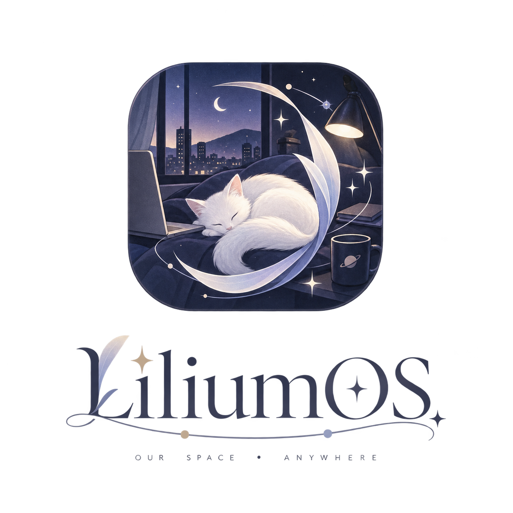

# LiliumOS // 手抓糯米机

基于 [SullyOS](https://github.com/qegj567-cloud/SullyOS) 的个人二改。一个装在浏览器里的虚拟手机系统——React + TypeScript + Vite，local-first，数据全存 IndexedDB。

---

## LiliumOS 扩展功能

以下功能全部是在上游基础上新增或深度改造的。

### 查手机增强

- **Claude 风格 UI**：暖色调排版（Shippori Mincho 衬线字体 + 暖棕配色）
- **小图标网格式自定义 App 页**：用户添加的 App 以小图标展示
- **通讯录（联系人列表）**：Message App 里自定义的联系人列表页，进聊天前先看联系人总览

### 向量记忆召回面板

私聊顶栏 ⚡ 面板同时展示 context 构成和本轮实际注入的记忆简报，让用户看到角色具体“想起”了什么；未触发召回时也会明确显示 0 条。

### Notion 日记增强

- **写 Notion 快捷**：聊天工具栏一键让角色写 Notion 私人日记
- **附加列**：日记自动填充角色名、心情等自定义列
- **只读数据库**：额外挂载多个 Notion 库，角色可按 TAG 查询

### 时光契约（日程）增强

- **约定**：精确到分钟，可选提醒（准时 / 提前 15 / 30 分钟），到点在聊天里推送
- **纪念日 ·「让角色记住这一天」**：可控制是否注入角色上下文
- **日程密度**：聊天里的“日程/情绪”设置可为每个角色调节每日 5–12 个时段（默认 8）；松手后重新生成当天日程
- **日常节律与睡眠区间**：生活系角色可保存详细作息或概述规律，并可设定跨午夜睡眠区间；夜间状态优先显示为“睡眠中”，生成日程会避开该时段

### 聊天语音条

- **文字也可作为语音发送**：用户可把输入文字显示成语音条；角色会在聊天历史中知道这是一条语音。
- **无 TTS 也可用**：角色开启语音消息后，即使未配置 MiniMax / Fish API，仍可发送可“转文字”的语音条；真实音频播放才需要音色和 API 配置。
- **主题跟随气泡工坊**：语音条的背景、播放时背景、按钮、波形与文字颜色均可在气泡工坊设置。

### 独立生图 API

- **不跟聊天 API 绑在一起**：设置页可单独选择内置免费生图，或填写 OpenAI Images 兼容接口；自定义接口支持拉取、搜索和手动填写模型名。
- **角色立绘参考**：自定义接口可把当前角色立绘作为面部特征参考，优先使用当前皮肤的正常立绘，并自动排除 Q 版形象。
- **聊天与主动消息共用**：私聊和主动消息里的 `SEND_PHOTO` 都走同一套生图配置；参考图不可用时会降级为纯文字生图。
- **常用画风**：聊天设置内置真实随拍、透明水彩、半写实幻想、韩系精绘、清透日漫、电影写真等预设；参考画风不会强制复制姿势、配色或背景。
- **本地调用记录**：自定义生成与参考图编辑都会记录模型、状态、耗时和中转方式，但不会保存 API Key 或立绘 Base64。

接口形状、隐私边界与降级规则见 [`docs/image-generation-api.md`](./docs/image-generation-api.md)。

### 七夕「星月梦境童话」

- **完整共同经历**：在「特别时光」选择角色，依次经历七个上下文夹层、记忆鹊桥、重逢与长按约定。
- **角色自己的 API**：新旅程生成前会明确提示 4 次模型调用，并使用所选角色绑定的聊天 API；重看旧记录不调用模型。
- **写回长期聊天**：完成后的活动卡、七个场景和约定会进入私聊与未来上下文，角色之后可以自然提起这段经历。
- **一次邀请、永久入口**：北京时间 2026-08-19 只弹一次邀请，活动本体永久保留在「特别时光」。

行为、存档与降级契约见 [`docs/qixi-special-moment.md`](./docs/qixi-special-moment.md)。
### Online / Busy / Offline 状态系统

角色根据日程 slot 自动切换在线状态。三层优先级：手动覆盖 > LLM 生成 > 关键词 fallback。offline 时插入🌙气泡 + 延迟回复；busy 时注入简短回复提示。

### 健康 App (Health)

Clay morphism 风格的健康记录器。支持训练 / 睡眠 / 饮食 / 经期 / 症状 / 体重、周期推算、饮食文字与照片识别，并把轻量健康摘要注入角色聊天。Apple Health 自动导入和 Notion 同步仍在开发。

### 地图 × 日程

自定义“彼此的世界”，角色位置由日程的 `regionId` / `location` 驱动。支持世界与地点编辑、角色头像 pin、当前活动和内心独白时间线，以及从地图直达聊天。

### Finance 记账

多账户、多币种、层级分类、收入/支出/退款/转账、周期性交易、资产趋势和分类分析。SimpleFIN 可只读同步美国账户的余额与交易，同时保留本地昵称、图标、颜色、层级分类和备注；新交易会进入待分类复核。角色可主动查看近期交易、搜索账目、汇总支出和读取账户快照。

### 投喂站 (Shopping)

包含网购与外卖店铺；店铺目录和店内商品列表独立滚动，长列表不会把商品挤出可操作区域。

### 共栖舱 (Smart Home)

统一控制 Home Assistant 中的灯光、空气净化器与场景。支持设备开关、灯光亮度/色温、按设备能力显示的 RGB 取色器、净化器风速/模式，并提供设备/场景同步入口；可把 Home Assistant MCP 接入角色工具。内置演示模式，真实设备连接需要 Home Assistant 地址和长期访问令牌。

### 设备运动感知

DeviceMotion API 加速度计，判断静止 / 走路 / 跑步 / 摇晃，注入角色聊天上下文。角色知道你在干嘛——"你在跑步吗？注意安全"。

### Intiface 硬件集成

通过 wss:// Tailscale 隧道连接 Intiface Central 蓝牙设备。Chat 模式 `control_toy` 工具默认开启，角色情绪/反应映射为震动模式。

### 共读 (epub 支持 + 用户批注)

彼方图书馆原本只支持 .txt，现已支持 **epub 格式**（JSZip 解压 + OPF spine 解析）。用户可以在阅读时**写批注**，角色下次读到会看到并回应。批注气泡区分用户/角色样式，支持回应某条批注。

### 桌面图标排序

长按拖拽排序。首页两个 widget 下保留三行（12 个）图标，第二页为 pinwheel，普通页面每页五行（20 个）图标。

### 完整备份

全量导出/恢复覆盖 EM 的 Finance、Health、Shopping、Map 数据、Smart Home 连接配置和 Finance 周期规则，以及剧情剧场的故事线、预设、面具与独立记忆设置。

---

## 上游功能概览（SullyOS）

| 功能 | 说明 |
|------|------|
| 💬 **Message** | 跟角色聊天，支持文字/图片/表情包 |
| 📞 **电话** | 语音通话 + TTS（MiniMax 音色） |
| 🏠 **小小窝** | 布置房间，放角色挂机 |
| 👥 **群聊** | 多角色群聊 |
| 📓 **交换日记** | 角色写关于你的事 |
| 📅 **时光契约** | 定时任务 / 纪念日 |
| 🔥 **Spark** | 社交媒体模拟，角色发朋友圈 |
| 🎮 **TRPG** | 跑团模式 |
| 🌍 **世界书** | 挂载设定集 |
| 🔍 **查手机** | 检查角色手机 |
| 🏦 **存钱罐** | 虚拟货币 / 记账 |
| 📚 **自习室** | 专注学习模式 |
| ✍️ **笔友会** | 写小说 / 找笔友 |
| 🎵 **写歌** | 歌词创作 |
| 📖 **攻略本** | 反向攻略小游戏 |
| 🏙️ **都市人生** | 模拟人生玩法 |
| ✨ **特别时光** | 节日活动 |
| 🎨 **气泡工坊** | 聊天气泡主题 |
| 👤 **外观** | 系统皮肤 |
| 🗺️ **自由活动** | 角色自主活动 |
| 🧠 **记忆宫殿** | 向量化长期记忆 + Russell 情感空间 |
| 🎧 **音乐（电波小屋）** | 接网易云 API，角色"一起听" |
| 💤 **记忆潜行** | 像素 RPG 风格探访角色记忆 |
| 🗓️ **见面 (Date)** | 陪伴见面模拟 + 多角色独立剧情剧场 |
| 📇 **档案 (User)** | 用户档案中枢 |
| 🌐 **彼方** | 虚拟世界系统——图书馆 / 音乐室 / 留言墙 / 邮局 / 剧场 |

---

## 本地运行

1. 安装 [Node.js](https://nodejs.org/)
2. `pnpm install`
3. `pnpm dev`
4. 大模型 API 在 App 内「设置」里配置

部署：**Vercel**（绑 GitHub main 分支自动部署）或 **GitHub Pages**（构建命令 `pnpm build`，输出目录 `dist`）。

当前开发进度见 [`docs/roadmap.md`](./docs/roadmap.md) 和 [`progress.md`](./progress.md)。
当前 `main` 发布基线为 `d214bf16`。公开仓库为 [Emma-Zhuym/LiliumOS](https://github.com/Emma-Zhuym/LiliumOS)，GitHub Pages 地址为 [emma-zhuym.github.io/LiliumOS](https://emma-zhuym.github.io/LiliumOS/)。

---

## 技术栈

- **React + TypeScript + Vite + Tailwind CSS** — 前端骨架
- **IndexedDB (Dexie)** — 本地数据存储
- **Capacitor** — 可打包安卓 App
- **JSZip** — epub 解析 / 数据导出
- **Phosphor Icons** — 图标库
- **Web Push + Instant Push** — 推送通知（基于 amsg-instant 0.8）

---

## ⚠️ 后端有几处接了原作的 sfworker，二改请换成自己的

项目是 local-first，但有几个功能绕不开代理/签名/跨域，走了 Cloudflare Worker。搜 `workers.dev` 全量替换成你自己的。

| 文件 | 功能 |
|------|------|
| `context/MusicContext.tsx` | 网易云音乐 weapi 代理 |
| `utils/realtimeContext.ts` | Brave 搜索 / 新闻联网 |
| `utils/webdavClient.ts` | WebDAV 代理（绕 CORS） |
| `utils/proactivePushConfig.ts` | 主动消息云端推送 |

Worker 代码在 `worker/` 目录，`wrangler deploy` 部署后替换 URL 即可。

---

## 致谢

- **TO 佬** — [ReiStandard](https://github.com/Tosd0/ReiStandard/) 主动消息协议 + Instant Push + 社区维护
- **xiaohongshu-skills** — 角色发小红书
- **Spider_XHS** (cv-cat) — 小红书 Lite 模式
- **NeteaseCloudMusicApi Enhanced** — 音乐搜索/播放
- **hot_news** (orz-ai) — 多平台中文热榜 API
- **animal-island-ui** (guokaigdg) — 动森风格设计语言参考
- **CSY 吱吱吱老师** — 优秀二改推荐
- **乔霖** — 新人教程与答疑

---

## 开源协议

**[PolyForm Noncommercial 1.0.0](https://polyformproject.org/licenses/noncommercial/1.0.0/)** — 署名 + 禁止商用。

- ✅ 个人使用、魔改、fork 发布（保留署名和 LICENSE）
- ❌ 商用（卖源码/卖成品/卖会员）
- ❌ 去掉署名
- ❌ 把 Sully 角色 IP 单独扒出来当素材

角色人设、台词风格、形象按《著作权法》单独保护。整个项目拿去玩随便，把 Sully 单独薅出去当免费素材就算了。

---

**[ 连接建立 // 等待输入 // 数据库停止咕咕叫 ]**

