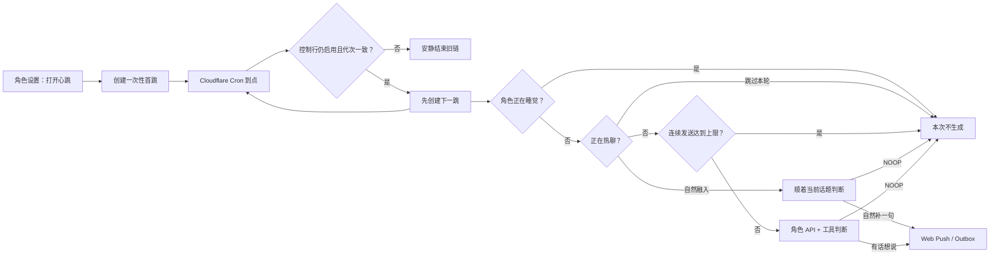

# Active Message 2.0 心跳醒来

> 状态：2026-08-18 已实现。前端与 `worker/amsg` 必须成对更新；旧 Cloudflare Worker 不支持滚动续排。

## 产品语义

- 心跳按角色单独开启，默认每 60 分钟一次，可选 30 分钟、1 小时、2 小时、4 小时。
- 实际下一跳会围绕所选间隔自然波动：约 10%，最低前后 5 分钟、最高前后 20 分钟，避免每次固定在同一分钟出现。
- 打开后约 3 分钟内进行第一次唤醒，之后由 Cloudflare Worker 续排，网页和 PWA 关闭也能继续。
- 唤醒不等于必须发消息。角色可以读取新鲜聊天快照、自己的到点记录和获准工具，再决定主动联系或保持安静。
- 保持安静时模型输出 `[[HEARTBEAT_NOOP]]`；Worker 会剥掉标记并走 `skip-push`，不产生聊天气泡或通知。
- 角色处于睡眠时段时，本次心跳在调用任何模型、情绪副 API 或工具之前安静跳过；明确设置的跨午夜睡眠区间优先，同时识别当天生成日程里的睡眠、午睡与休眠时段。
- 用户正在和同一角色热聊时可按角色选择「自然融入」或「跳过本轮」。缺省为跳过：在 API 调用前直接让路；自然融入则临时追加热聊约束，让这次心跳只顺着当前话题补一条短消息，没合适内容仍输出 `[[HEARTBEAT_NOOP]]`。
- 「自然融入」是一条独立的心跳生成与消息气泡，不会改写已经在飞的即时回复；它只借最新对话约束内容、避免另起话题。角色连续主动发送达到 `maxUnansweredSends` 时仍沿用现有防骚扰闸。
- 睡眠与「跳过本轮」都发生在 API 调用之前；「自然融入」以及进入角色判断后又选择 `[[HEARTBEAT_NOOP]]` 的安静会消耗本次模型调用。
- 每个角色可选「省钱唤醒」：直接复用其「情绪 / 意识流」里已保存的副 API，只改变心跳链；普通聊天、即时对话与普通排程保持原路由。副 API 三件套不完整时，创建首跳会安全回落到主动消息默认 API。

## 后台链

心跳使用一串 `recurrenceType: none` 的隐藏任务，而不是上游只支持的 daily / weekly 循环。每次 fire 先调用 `ctx.scheduleTask()` 创建下一跳，再做热聊、上下文和模型判断。下一跳 UUID 由角色和触发时刻确定，同一次 fire 重试只会命中 duplicate，不会长出并行分支。

时间波动不是直接调用 `Math.random()`：`nextHeartbeatTimeMs()` 以角色、心跳代次和名义下一跳时间计算确定性伪随机偏移。相邻心跳看起来不机械，但同一次 fire 重试永远得到同一时刻和同一 UUID；Cron 晚到时会跳过已经过期的候选，不补跑一串旧心跳。

睡眠闸的数据随 `fire_pack v8` 上云：`sleepWindow` 是必填的 `区间 | null`，防止新版 Worker 把缺字段的旧包误当成清醒；`scene` 则携带当天生成日程的轻量 slots。Worker 按角色 `tzId` 计算跨午夜区间。没有明确区间时，仅对“睡眠 / 午睡 / 入睡 / 休眠”等明确日程词命中，不把开会、工作或普通忙碌误判成睡觉；前一晚最后一个睡眠 slot 只允许延续到次日第一项之前，更旧日程不再使用。

选择情绪副 API 时，新版 Worker 的任务只携带 `credRefs.chat = char:<id>/emotion` 这一不含秘密的引用；Key 保存在 `llm_credentials`，后续隐藏任务从父任务继承同一引用。切换该选项会换代并重建首跳，使整条新链从第一轮起采用正确通道。

## 停止与改频率

`heartbeat_control` 存在角色自己的 `client_state` namespace，包含：

- `enabled`
- `intervalMinutes`
- `activeChatPolicy`（`skip` / `merge`；旧控制行缺字段时按 `skip`）
- `generation`
- `updatedAt`

关闭或改频率会先换掉控制行的 `generation`，再取消旧的隐藏任务。即使旧任务正好已经被 Cron 取走，它也会因代次不一致而停止续排，避免产生关不掉的幽灵心跳。切换热聊策略只原位更新控制行，不换代、不重建任务，也不会把下一次唤醒重置到三分钟后。

## 文件边界

- `utils/amsgHeartbeat.ts`：浏览器与 Worker 共用的纯协议、频率、NOOP、热聊策略、控制行和幂等 UUID。
- `utils/amsgSleepGuard.ts`：明确睡眠区间与生成日程的纯睡眠判定，按角色时区运行。
- `utils/amsgFirePack.ts`：`fire_pack v8` 的睡眠字段与严格形状校验。
- `utils/activeMsgClient.ts`：创建首跳、写控制行、切换代次、取消旧链。
- `worker/amsg/src/index.ts`：续排下一跳、睡眠门禁、热聊融入 / 让路和 NOOP 静默。
- `components/chat/ActiveMsg2SettingsModal.tsx`：每角色开关、四档频率与热聊时行为。
- `utils/amsg2Tasks.ts`：心跳保持 fire_pack 同步，但不混入普通任务清单。

## 部署与验收

1. 发布前端。
2. 在「设置 → 主动消息 2.0」重新复制最新 Worker 代码并覆盖 Cloudflare Worker。
3. 确认 D1 binding、VAPID 和每分钟 Cron 仍正常。
4. 在角色 Chat 的更多功能第二页打开「主动消息 2.0」，先开启该角色的 2.0，再打开心跳。
5. 面板会提示第一次唤醒的大致时间；关闭网页等待实际推送。
6. 关闭心跳后再次查看远端任务，确认没有 `messageSubtype: heartbeat` 的 pending 行。
