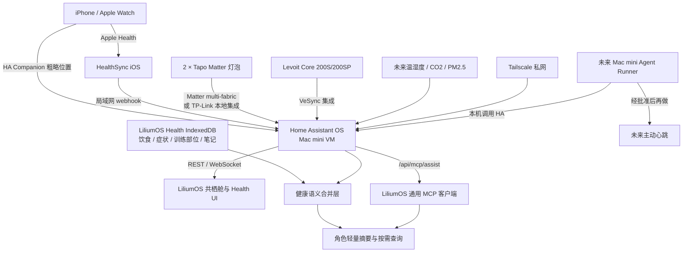

# LiliumOS × Home Assistant 完整接入与 Mac mini 交接方案

> 状态：实施方案，尚未完成真实设备联调
> 更新时间：2026-08-26
> 适用对象：Emma、Mac mini 上接手部署的 Codex / Claude Code，以及后续维护 LiliumOS 的 Agent

## 1. 一句话结论

Home Assistant 负责汇集真实设备、Apple Health、位置和自动化；LiliumOS 继续负责统一界面、手工健康记录、角色语义和权限。Mac mini 作为常驻主机，推荐运行 **Home Assistant OS 虚拟机**；Tailscale 负责 Emma 自己设备间的私有访问，不直接把 Home Assistant 暴露到公网。

这不是重做现有「共栖舱」。仓库已经完成 Home Assistant REST 读取/控制、官方 MCP 接入、演示模式、备份和 UI；当前工作的重点是部署真实主机、接入真实实体、修正敏感配置边界并完成验收。

## 2. 当前事实与边界

### 已经完成

- `apps/SmartHomeApp.tsx`：共栖舱设备/场景界面。
- `utils/smartHome.ts`：Home Assistant REST 状态读取与服务调用。
- 支持灯光开关、亮度、色温、按能力显示 RGB、风扇/净化器档位、场景、温湿度/CO2/PM2.5/PM10 展示。
- 可把 Home Assistant `/api/mcp/assist` 注册进 LiliumOS 通用 MCP 客户端。
- 演示模式可在 Home Assistant 尚未上线时继续使用。
- 位置感知已有前台、本机、粗粒度工具 `get_user_coarse_location`。
- Health App 已有手工训练、饮食、睡眠、经期、症状、体重和角色聊天摘要。

### 尚未完成

- Mac mini 上的 Home Assistant 常驻部署。
- 两只 Tapo Matter 灯泡和 Levoit Core 200S/200SP 的真实实体验收。
- Apple Health → Home Assistant → LiliumOS Health 的正式数据链。
- Home Assistant 位置与 LiliumOS 本机围栏的统一语义层。
- 面向角色的稳定高层工具和严格实体白名单。
- 主动心跳后端。此前心跳实验已撤回，不能把本方案写成已上线能力。

### 不在本阶段做

- 不迁移全部 LiliumOS IndexedDB 到 Home Assistant。
- 不让 Home Assistant 取代 Health App 的手工记录。
- 不让云端 Worker 直接控制家庭设备。
- 不上传持续 GPS 轨迹。
- 不把 Home Assistant 管理员令牌、地址坐标或健康原始样本写入 Git、Engram、日志或普通备份。

## 3. 推荐架构



## 4. 为什么正式环境选 HAOS 虚拟机

### 推荐：Mac mini + Home Assistant OS VM

Home Assistant 官方目前把 HAOS 作为推荐安装类型；macOS 官方路线也是在虚拟机中运行 HAOS。Matter 集成依赖独立 Matter Server，官方文档当前只支持 HAOS 中的 Matter Server App，容器方式属于自行维护、风险自负。

对 Emma 来说，虚拟机是一次性的安装成本，不是每天要操作的东西。配置自动启动后，日常只打开 Home Assistant 网页或 LiliumOS。

建议资源：

- 2 vCPU。
- 4 GB 内存起步；官方最低 2 GB，但还要留给 Matter、HACS 和历史数据。
- 32 GB 动态磁盘。
- 桥接网络；Mac mini 若能接网线，优先以太网。
- macOS 允许显示器睡眠，但系统本身不要自动睡眠。
- VM 设置随 Mac 登录自动启动；Mac mini 重启后必须自动恢复。

官方参考：[macOS 安装](https://www.home-assistant.io/installation/macos)、[安装类型比较](https://www.home-assistant.io/installation/)、[Matter 集成](https://www.home-assistant.io/integrations/matter/)。

### 备选：Home Assistant Container

只有在明确放弃 Home Assistant 直接管理 Matter、并愿意手工维护 HACS/升级/备份时才选。可以先通过 TP-Link 本地集成尝试灯泡，Apple Home 继续保留 Matter；但具体灯泡型号是否完整支持仍需真机验证。

本方案不把 Container 作为正式默认，避免后续为了 Matter 再迁移一次。

### 将来嫌 VM 仍然麻烦

可以把 HAOS 备份恢复到 Home Assistant Green 或独立小主机。LiliumOS 只需要换 Home Assistant 地址和令牌，设备语义映射不应重写。

## 5. Mac mini 实施顺序

### Phase 0：部署前准备

1. 确认 Mac mini 固定放置、接电并加入现有 Tailscale。
2. 推荐接网线；没有网线时先用 Wi-Fi 桥接测试设备发现。
3. 在路由器里给 HAOS VM 保留固定 DHCP 地址。
4. 保存两只 Tapo 灯泡的 Matter QR / 配对码照片，但不要放进仓库。
5. 不删除灯泡在 Apple Home / Tapo App 中的现有配置。

验收：Mac mini 重启后远程桌面、Tailscale 和网络都能恢复。

### Phase 1：安装 HAOS

1. 按 Home Assistant macOS 官方文档安装 Apple Silicon 对应的 HAOS 镜像。
2. 创建 Home Assistant 管理员账户，时区设为 `America/Chicago`。
3. 设置家庭位置时只在 Home Assistant UI 中填写，不写入本文件。
4. 完成第一次完整备份，并下载一份到 Emma 的私有存储。
5. 安装 iPhone Home Assistant Companion App，先只连接局域网地址。

验收：

- 局域网可打开 Home Assistant。
- Mac mini 和 VM 重启后 Home Assistant 自动恢复。
- Home Assistant 备份可以下载。

### Phase 2：接入 Tapo 灯泡

优先按下面顺序尝试，成功后不继续折腾另一条路线：

1. **先试 TP-Link Smart Home / Tapo 原生集成**。它是本地轮询，支持的灯可提供开关、亮度、颜色和色温；保留灯泡在 Apple Home 的 Matter 关系。
2. 若型号不支持、能力缺失或发现不稳定，再安装 Matter 集成，通过 iPhone Companion 的“已在使用”流程，把 Apple Home 中的灯共享给 Home Assistant，使用 Matter multi-fabric。
3. 不要先恢复出厂设置。只有两条路线都失败且配对信息已备份时才考虑重置。

官方参考：[Tapo](https://www.home-assistant.io/integrations/tplink_tapo)、[TP-Link Smart Home](https://www.home-assistant.io/integrations/tplink/)、[Matter 多平台共享](https://www.home-assistant.io/integrations/matter/#sharing-a-device-from-another-platform-with-home-assistant)。

每只灯验收：

- Apple Home 和 Home Assistant 都能控制。
- 开关状态双向同步。
- 亮度滑杆有效。
- 色温滑杆有效。
- 若设备支持 RGB，取色器有效；不支持时 LiliumOS 不显示取色器。
- 断网但局域网存在时仍能从 Home Assistant 控制。

### Phase 3：接入 Levoit 空气净化器

1. 设备继续保留在 VeSync App。
2. Home Assistant → 设置 → 设备与服务 → 添加 `VeSync`。
3. 登录后确认出现 `fan.*` 主实体及相关 `switch.*` / `sensor.*`。
4. 记录真实实体名、preset modes、percentage、显示灯和夜间自动熄屏字段。

Core 200S 在官方 VeSync 支持列表中；Emma 设备口头型号曾写作 200SP/200S-P，因此必须以 HA 实际发现为准，不在代码里猜型号。官方参考：[VeSync 集成](https://www.home-assistant.io/integrations/vesync/)。

验收：

- 开关、风速百分比、可用 preset 全部真实有效。
- VeSync App 与 Home Assistant 状态能同步。
- Home Assistant 重启后实体仍可用。
- LiliumOS 不为设备不存在的能力显示控件。

### Phase 4：建立场景

先在 Home Assistant 中创建真实场景，LiliumOS 只同步和触发：

- `回家`：按偏好开灯、净化器自动档。
- `离家`：关灯，净化器按 Emma 决定关闭或低档。
- `晚安`：灯光关闭或低亮暖色，净化器睡眠档。
- `专注`：较亮中性光，净化器自动档。

LiliumOS 的 `+` 后续可以做成“打开 Home Assistant 创建场景”或“建立本地快捷组合”，但第一阶段不在 LiliumOS 复制一套场景引擎。

## 6. Apple Health 数据方案

### 数据归属

| 数据 | 权威来源 | 在 LiliumOS 中的用途 |
|---|---|---|
| 心率、HRV、静息心率、步数、活动能量、锻炼时间、睡眠、体重 | Apple Health → Home Assistant | 客观指标、趋势、按需查询 |
| 训练部位、动作、主观强度 | LiliumOS Health App | 训练语义与角色理解 |
| 饮食与摄入估算 | LiliumOS Health App | 当日摄入和饮食上下文 |
| 症状、经期、备注 | LiliumOS Health App | 私人手工记录 |

两边不互相覆盖。角色看到的是合并后的摘要，例如：

```text
Apple Health：活动能量 412 kcal，锻炼 48 分钟，平均睡眠 6.8 小时
LiliumOS：今天训练胸+肩；右肩轻微酸；午餐已记录
```

### 推荐同步方式：HealthSync for Home Assistant

认准 App Store ID `6794884113`、开发者 **Jamie Hill** 的
[HealthSync for Home Assistant](https://apps.apple.com/app/id6794884113)，以及同一项目的开源
[Home Assistant / HACS 配套集成](https://github.com/mannotfood/healthsync)。GitHub 账号名是
`mannotfood`，不是另一款同名软件。iPhone 从 HealthKit 读取后直接向 Emma 自己的 Home
Assistant webhook 推送，不经过开发者服务器；手动同步免费，自动后台同步为可选的一次性购买。

推荐同步：

- 步数、活动能量、锻炼时间、静息能量、步行与跑步距离、爬楼层数。
- 睡眠阶段与 workout。
- 最近心率、静息/步行心率、心率恢复、HRV、血压、血氧、呼吸率、血糖、体温与 VO₂ max。
- 体重、BMI、体脂、瘦体重、身高和腰围。

不建议把每条心率样本每轮都灌给角色。Home Assistant 可以保存原始历史，但 LiliumOS 默认只取“最新值 + 今日/七日摘要”。

实施：

1. HAOS 安装 HACS。
2. HACS 安装 HealthSync 集成并重启。
3. Home Assistant 添加 HealthSync，生成独立 webhook 和 shared secret。
4. iPhone App 中填完整 webhook，先用免费手动同步测试。
5. 验收成功后再决定是否开启自动后台同步。

若 iOS 偶发显示 `Swift CancellationError`，表示这一批上传任务在完成前被系统或网络切换取消，
不等同于健康数据格式损坏。重新打开 HealthSync 并手动同步即可；配套 HA 集成会对整批重传去重。
LiliumOS 以最后成功的 `data_as_of` 为准，不把失败那次伪装成新数据。

当前 `apple-health-shortcuts-mcp` Worker 和已制作的快捷指令保留作研究/应急回退，但不再继续复制大量魔法变量块作为主方案。

### LiliumOS Health 接入方式

新增一个外部健康适配层，不把 Home Assistant 原始实体直接塞进现有 Health DB：

```ts
interface ExternalHealthSnapshot {
  updatedAt: string;
  stepsToday?: number;
  activeCaloriesToday?: number;
  exerciseMinutesToday?: number;
  latestHeartRate?: number;
  restingHeartRate?: number;
  hrvMs?: number;
  sleepHoursLastNight?: number;
  latestWeight?: number;
  lastWorkout?: {
    type?: string;
    durationMinutes?: number;
    calories?: number;
    startedAt?: string;
  };
}
```

- Health UI：增加“Apple Health 同步数据”只读区和更新时间。
- `healthContextBuilder`：把外部摘要与本地手工记录合并。
- 角色详细查询：通过高层健康工具按需读今天、昨天、指定日期或最近七天；按活动/睡眠/心率节律/锻炼/身体类别最小化读取，不直接读全部原始样本，也不向角色提供血氧。
- LiliumOS 手工选择的胸/肩/背等训练部位优先补充 workout 语义，不覆盖 Apple Watch 的时长和热量。

## 7. 位置方案

### 当前前台聊天

继续使用现有 `get_user_coarse_location`。它只在角色确有需要时调用，返回 `家 / 学校 / 某超市 / 在外面 / 未知`，不返回经纬度。

### Home Assistant Companion

启用 iPhone Companion 的位置权限后，Home Assistant 维护 `device_tracker` 和 zone。Home Assistant 中创建的家、学校、超市 zone 作为自动化来源；LiliumOS 仍只消费语义名称。

### 未来主动心跳

未来 Mac mini Agent Runner 被唤醒后，可以在本机查询 Home Assistant 的 coarse zone，再决定要不要联系 Emma。规则：

- 默认只读 zone，不读精确坐标。
- `在外面`不自动反查具体商店或街道。
- 精确定位必须是 Emma 当轮明确要求。
- 心跳失败不得影响用户主动聊天。

## 8. LiliumOS 与 Home Assistant 的连接

### UI 数据与控制：REST

共栖舱继续通过 REST：

- `GET /api/`：测试连接。
- `GET /api/states`：发现设备与传感器。
- `POST /api/services/<domain>/<service>`：控制设备和触发场景。

前端展示和滑杆不走 MCP。MCP 是给角色调用的，不是 UI 数据层。

### 角色工具：官方 MCP

Home Assistant 安装 `Model Context Protocol Server` 集成后，使用 `/api/mcp/assist`。该端点是 Streamable HTTP，符合 LiliumOS 通用 MCP 客户端现有契约。只向 Assist 暴露允许角色看到的实体。

官方参考：[Home Assistant MCP Server](https://www.home-assistant.io/integrations/mcp_server/)。

推荐给模型看到的高层能力：

- 查看家中概况。
- 查看灯、净化器和环境读数。
- 控制指定灯光。
- 控制净化器。
- 启动已批准场景。
- 查看健康今日摘要/近期趋势。
- 查看 Emma 的粗略位置状态。

即使 HA MCP 最终只暴露少量 Assist 工具，也应通过 Home Assistant 的实体 exposure 和别名让模型看到稳定中文名称，避免提示词依赖 `light.tapo_l535_1234` 之类原始 ID。

## 9. 网络方案

### 局域网

- Home Assistant VM 使用固定局域网地址。
- Mac mini 本机和家中设备直接访问该地址。
- iPhone HealthSync 在家中可直接向局域网 webhook 同步。

### Tailscale

- Emma 的 iPhone、MBA、Mac mini 加入同一 tailnet。
- 用 Tailscale Serve 在 Mac mini 提供私有 HTTPS 反向代理到 HAOS VM。
- GitHub Pages 上的 LiliumOS 通过该私有 HTTPS 地址访问；手机必须保持 Tailscale 已连接。
- HAOS 在确认 Mac mini 代理地址后配置 `trusted_proxies` / `use_x_forwarded_for`，并只把 LiliumOS 正式 Pages origin 和 localhost 加入 `cors_allowed_origins`；不要使用 `*`。
- 不使用路由器端口转发。

### 公网与 Cloudflare

第一阶段不需要 Cloudflare。若以后要求 HealthSync 离家也自动推送，可三选一：

1. iPhone 保持 Tailscale，HealthSync 使用私有 Serve 地址。
2. 使用 Home Assistant Cloud/Nabu Casa 的 cloudhook。
3. 只公开一个带 secret 的 webhook，而不是公开完整 Home Assistant。

Cloudflare Tunnel 只可作为受控入口，不是状态库，也不应再次承担浏览器 CORS 万能代理。

当前 Mac mini 私有 HTTPS 入口复用一个 origin：`/api/*` 转发到 Home Assistant（包含 HealthSync 的 `/api/webhook/*`），`/mcp` 转发到 Apple Calendar / Reminders bridge。这样 GitHub Pages 不再从 HTTPS 页面请求局域网 HTTP 地址，Apple Events MCP 也不会再落到 Home Assistant 而返回 404。

未来云端主动消息不直接访问家庭 HA。Mac mini Agent Runner 在本机调用 HA，再把必要结果送入主动消息链。

## 10. 安全与隐私闸门

### 已完成的凭据边界

`exportSmartHomeLocal()` 现在只保留 Smart Home 地址、演示模式和非敏感映射；Home Assistant
token 与代理密钥会被默认剥离。由于开启 HA MCP 时同一枚 token 也会复制进通用 MCP 配置，
`exportMcpLocal()` 也会对识别为 Home Assistant 的服务器剥离 token、代理密钥和自定义请求头，
恢复时保持停用，等待用户重新填入凭据并测试。若将来提供“包含凭据的加密备份”，必须显式
选择并单独说明风险。

### Home Assistant 账户

- Emma 保留管理员账户，只用于管理。
- 为 LiliumOS 创建独立非管理员用户和长期访问令牌。
- 令牌只存在浏览器本地和 Mac mini 的权限受限秘密存储，不写进代码或文档。
- Home Assistant MCP 只 exposure 灯、净化器、场景、选定传感器和健康摘要。

### 角色副作用分级

| 等级 | 行为 | 默认规则 |
|---|---|---|
| 只读 | 状态、环境、健康摘要、粗略位置 | 可按需调用 |
| 可逆低风险 | 灯光、净化器、普通场景 | 允许角色在语境明确时执行，并显示工具通知 |
| 中风险 | 离家/晚安等批量场景 | 用户明确要求，或以后单独批准自动化 |
| 高风险 | 门锁、车库、烤箱、购买 | 当前不接入；未来每次明确确认 |

## 11. 未来设备接入原则

优先选择能被 Home Assistant 本地集成、Matter、Zigbee 或 Thread 支持的设备；Apple Home 是并行控制入口，不是 LiliumOS 的数据源。

优先级：

1. 温湿度传感器。
2. 真实 CO2 传感器（确认使用 NDIR）。
3. PM2.5 传感器；若净化器自身已经提供可靠 PM2.5，可先不重复购买。
4. 门窗/人体存在传感器，用于自动化而非监控轨迹。
5. 智能插座，用于普通电器和能耗查看。

购买前确认四项：具体型号、接入协议、是否需要额外 hub、Home Assistant 对该型号的实体能力。不要只看包装上的“支持 Matter”就假设所有高级功能都存在。

## 12. 分阶段代码实施清单

### P0：真实连接前

- [x] Smart Home 与其 HA MCP 副本的备份默认剥离 token / proxyKey / 敏感请求头，并补回归测试。
- [ ] 为真实 Home Assistant 配置增加“最后连接成功时间”和清晰错误分类。
- [ ] 文档记录真实 HA 地址的填写位置，但不记录地址和令牌本身。

### P1：真实设备验收

- [ ] HAOS VM 常驻与重启恢复。
- [ ] 两只 Tapo 灯的开关、亮度、色温、可选 RGB。
- [ ] Levoit 的开关、百分比、preset、显示灯能力。
- [ ] Home Assistant 场景同步与触发。
- [ ] 共栖舱桌面和手机真机检查。
- [ ] 把实际实体能力写进测试夹具，不把家庭实体 ID 写进公共示例。

### P2：Apple Health

- [x] HealthSync 手动同步验收。
- [x] `ExternalHealthSnapshot` 适配层。
- [x] Health UI 客观数据只读区。
- [x] `healthContextBuilder` 合并外部数据与手工记录。
- [x] 今天/昨天/指定日期/最近七天与最近 workout 的角色按需工具。
- [x] 去重、日期分桶、过期数据和 HA 离线缓存降级测试。

当前适配层仍按 Jamie Hill 配套集成公开的实体契约保存完整 HA 指标，但角色常驻摘要只看生活
节律；明确健康语义才启用独立高层工具，并只返回所需的按日聚合与新鲜度。血氧、错误占位体脂
和不可信身高不会交给角色。首页保持四项摘要，避免把 Health App 变成传感器列表；逐样本原始
历史与独立可视化趋势仍未开放。缓存新鲜度、HA 离线回退、英美制单位换算、日期分桶和无关实体
过滤已有回归测试，首次真实手机同步也已验收。

### P3：位置与角色工具

- [ ] HA zones 与 LiliumOS `home/school/supermarket/outside` 语义映射。
- [ ] Home Assistant MCP exposure 白名单。
- [ ] 角色工具调用通知与失败回填验收。
- [ ] 场景/控制类工具的确认策略测试。

### P4：未来 Agent Runner / 心跳

- [ ] Mac mini 本地读取 HA，不让云 Worker 直接打家庭设备。
- [ ] 心跳旁路化，失败不影响主动聊天。
- [ ] 每角色独立 API、工具白名单、冷却和预算。
- [ ] 先做“只判断不发消息”影子运行，再批准真实推送。

## 13. 最终验收场景

1. 手机在家：LiliumOS 显示两只灯和净化器，滑杆控制真实生效。
2. 手机在外：Tailscale 开启后仍能打开共栖舱；关闭 Tailscale 后家庭控制不可达而不是误报成功。
3. Apple Home 控灯后，Home Assistant 与 LiliumOS 在合理时间内同步状态。
4. 对角色说“把卧室灯调暖一点”，界面出现工具调用提示，真实灯改变，角色拿到结果。
5. 对角色问“我今天活动怎么样”，回答合并 Apple Health 的客观数据和 Health App 的训练部位，不把原始心率列表全部输出。
6. Home Assistant 离线：聊天仍可用，Smart Home/Health 外部数据明确显示过期或离线。
7. Mac mini 重启：HAOS、Tailscale 入口和既有 Apple Events Bridge 自动恢复。
8. 导出 LiliumOS 完整备份：文件中搜不到 Home Assistant token、代理密钥、家庭坐标或 HealthSync secret。

## 14. Mac mini 新 Work session 的第一条任务

在 Mac mini 打开同步后的 SullyEM 项目，并让新的 Agent 先阅读：

1. `.claude/CLAUDE.md`
2. `docs/roadmap.md`
3. 本文件 `docs/home-assistant-mac-mini-plan.md`
4. `docs/mcp-client.md`
5. `docs/location-awareness.md`
6. `docs/health-app-design.md`
7. `utils/smartHome.ts`
8. `apps/SmartHomeApp.tsx`

接手指令建议：

```text
先只读检查仓库与 docs/home-assistant-mac-mini-plan.md，不改代码、不提交、不 push。
确认 Mac mini 当前网络、虚拟化软件、Tailscale 和自动启动条件，然后带我完成 Phase 0 和 Phase 1。
任何令牌、家庭地址、GPS 坐标都不要写进仓库、日志或 Engram。
```

完成 HAOS 和真实设备验收后，再回到 MBA 上实施 P0 安全修复与 LiliumOS 数据适配。不要在设备实体尚未出现前猜字段写代码。
